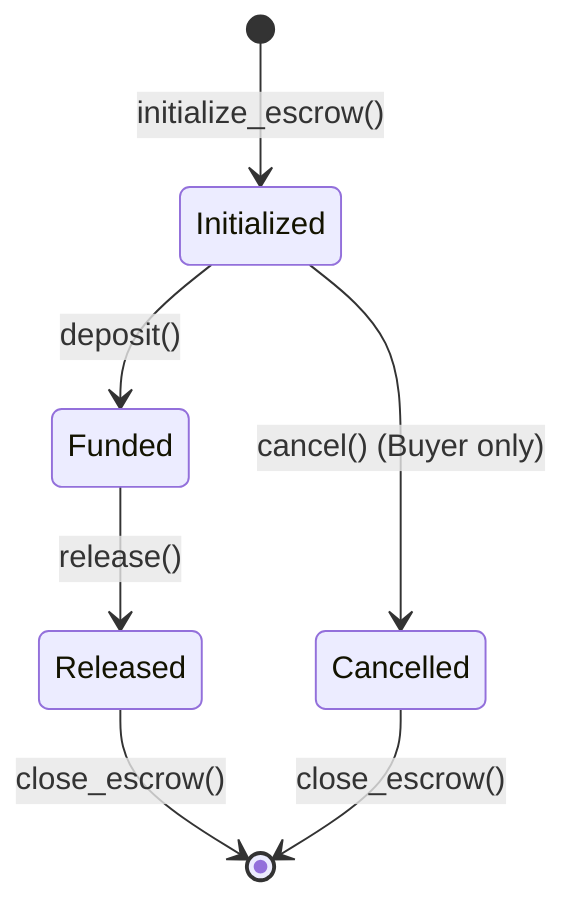

# Solana Escrow System

A secure, feature-rich, and production-ready escrow system built on Solana blockchain using Anchor framework.

[](https://opensource.org/licenses/MIT)
[](https://solana.org)
[](https://anchor-lang.com)

## Features

- **Secure**: Patched against Rug Pulls and Arbiter Replacement attacks
- **Timeout Support**: Automatic release mechanisms with configurable timeouts
- **Dispute Resolution**: Built-in arbiter system for conflict resolution
- **Flexible**: Support for any SPL token with customizable release conditions
- **Event System**: Comprehensive event emission for real-time monitoring
- **Frontend Ready**: React components and JavaScript SDK included

## Deployed on Devnet

**Program ID:** `9pZmQesbcR58wxt3bncrm1S615sv2nr3LJYpcah1B6LB`

You can interact with this program immediately using the client scripts.

## Architecture

```
+-------------------+    +-------------------+    +-------------------+
|      Buyer        |    |     Escrow        |    |      Seller       |
|                   |    |    Program        |    |                   |
|   +-----------+   |    |                   |    |   +-----------+   |
|   |   Funds   |---+--->|---> Vault --------+--->|-->|  Release  |   |
|   +-----------+   |    |                   |    |   +-----------+   |
+-------------------+    +-------------------+    +-------------------+
                                 |
                        +-------------------+
                        |     Arbiter       |
                        |   (Optional)      |
                        +-------------------+
```

## Quick Start

### Prerequisites

- **Rust** (1.79.0+)
- **Solana CLI** (v1.18.x)
- **Anchor CLI** (v0.29.0)
- **Node.js** (v16+)
- **Yarn**

### Installation

1. **Clone the repository**
   ```bash
   git clone https://github.com/polymatx/escrow-system.git
   cd escrow-system
   ```

2. **Install dependencies**
   ```bash
   yarn install
   ```

3. **Build the program**
   ```bash
   anchor build
   ```

4. **Run the Example (Devnet)**
   
   Ensure you have a Devnet wallet configured in `~/.config/solana/id.json`.
   
   ```bash
   # Set provider to Devnet
   export ANCHOR_PROVIDER_URL="https://api.devnet.solana.com"
   export ANCHOR_WALLET="$HOME/.config/solana/id.json"
   
   # Run the script
   node client/working-example.js
   ```

## Security Updates

This contract has been patched to address critical vulnerabilities:

1. **Rug Pull Prevention**: The `cancel()` instruction is now strictly restricted to the `Initialized` state. Once a buyer deposits funds (moving to `Funded` state), they **cannot** unilaterally cancel the escrow to withdraw funds. Only the Arbiter or a timeout/release condition can move the funds.

2. **Arbiter Locking**: The `set_arbiter()` instruction is restricted to the `Initialized` state. The buyer cannot change the arbiter address once the trade has begun.

## State Management


```mermaid
stateDiagram-v2
    [*] --> Initialized: initialize_escrow()
    Initialized --> Funded: deposit()
    Initialized --> Cancelled: cancel() (Buyer only)
    Funded --> Released: release()
    Released --> [*]: close_escrow()
    Cancelled --> [*]: close_escrow()
```

## Smart Contract API

### Instructions

| Instruction | Description | Authority Required |
|-------------|-------------|-------------------|
| `initialize_escrow` | Create new escrow | Buyer |
| `deposit` | Fund the escrow | Buyer |
| `release` | Release funds to seller | Buyer / Arbiter / After Timeout |
| `cancel` | Cancel and refund to buyer | Buyer (Initialized state only) |
| `set_arbiter` | Set dispute resolver | Buyer (Initialized only) |
| `update_conditions` | Modify release conditions | Buyer (before funding) |
| `close_escrow` | Close account and recover rent | Buyer (after completion) |

## Integration Guide

Want to use this escrow system in your platform? Here's how:

### Option 1: Use the JavaScript/TypeScript SDK

```typescript
import { Connection, PublicKey, Keypair } from '@solana/web3.js';
import { BN } from '@coral-xyz/anchor';

// Copy client/escrow-client.ts to your project, then:
import { createEscrowClient } from './escrow-client';

const PROGRAM_ID = "9pZmQesbcR58wxt3bncrm1S615sv2nr3LJYpcah1B6LB";

// Initialize client
const connection = new Connection("https://api.devnet.solana.com");
const escrowClient = await createEscrowClient(
  connection,
  wallet,
  new PublicKey(PROGRAM_ID)
);

// Create an escrow
const { escrow, vault } = await escrowClient.initializeEscrow(buyerKeypair, {
  amount: new BN(1000000),        // 1 USDC (6 decimals)
  seller: sellerPublicKey,
  mint: usdcMint,
  releaseConditions: "Product delivery confirmed",
  timeoutDuration: new BN(7 * 24 * 3600), // 7 days
});

// Deposit funds
await escrowClient.deposit(buyerKeypair, escrow, usdcMint);

// Release to seller (when conditions met)
await escrowClient.releaseFunds(buyerKeypair, escrow);
```

### Option 2: Direct Program Interaction

Use the Program ID with any Solana SDK:

```
Program ID: 9pZmQesbcR58wxt3bncrm1S615sv2nr3LJYpcah1B6LB
IDL: target/idl/escrow_system.json
```

### Option 3: React Components

```tsx
import { EscrowUI } from './frontend/escrow-ui';

function App() {
  return (
    <EscrowUI programId="9pZmQesbcR58wxt3bncrm1S615sv2nr3LJYpcah1B6LB" />
  );
}
```

### Option 4: REST API Microservice (PHP, Python, Go, etc.)

Run the microservice and call it from any backend:

```bash
cd microservice
npm install
npm start
# Server runs on http://localhost:3001
```

Then from your backend:

```php
// PHP Laravel
$response = Http::post('http://localhost:3001/escrow/create', [
    'buyerKeypair' => $keypair,
    'seller' => $sellerAddress,
    'mint' => $usdcMint,
    'amount' => 1000000,
]);
```

```python
# Python
response = requests.post('http://localhost:3001/escrow/create', json={...})
```

```go
// Go
resp, _ := http.Post("http://localhost:3001/escrow/create", "application/json", body)
```

See [microservice/README.md](microservice/README.md) for full API documentation.

### What You Get

| Feature | Description |
|---------|-------------|
| SPL Token Support | Works with USDC, USDT, or any SPL token |
| Arbiter System | Optional third-party dispute resolution |
| Timeout Protection | Auto-release after configurable period |
| Event Monitoring | Real-time escrow status updates |
| Security | Rug-pull and fraud protection built-in |

## Documentation

- [Integration Guide](docs/integration.md) - CPI integration for other Solana programs
- [API Reference](docs/api.md) - Client SDK documentation
- [Deployment Guide](docs/deployment.md) - How to deploy to devnet/mainnet
- [Security](docs/security.md) - Security model and best practices
- [Troubleshooting](docs/troubleshooting.md) - Common issues and solutions

## Contributing

We welcome contributions! Please see our [Contributing Guide](CONTRIBUTING.md) for details.

## License

This project is licensed under the MIT License - see the [LICENSE](LICENSE) file for details.
